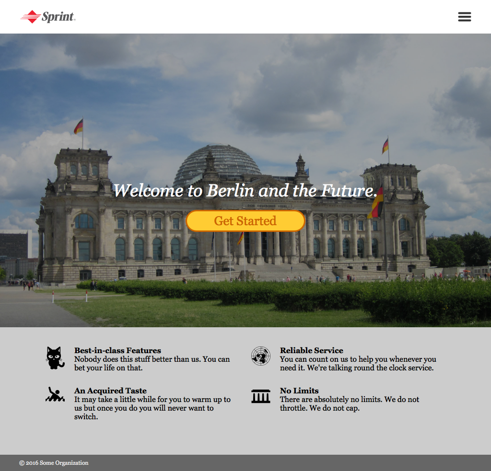
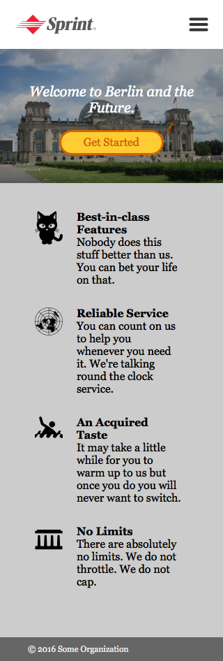
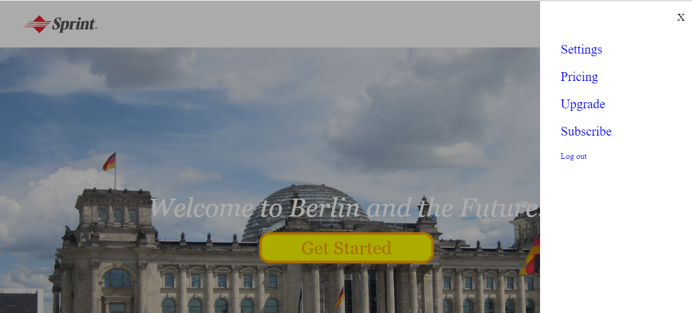

# Project 1 Let's make a webpage!

## Part 1 Create a webpage 
By means of using the image assets that can be found in the <a href="assets">assets directory</a>, the following webpage is created:

## Part 2 Make it responsive
As a next step the webpage is improved to display nicely on phones.

## Part 3 Sliding menu and grey-out background
Upon clicking the 'hamburger' menu on the top right corner, the background is grey-outed and the menu sliding in from the right. Clicking the 'X' button or the grey-outed background shall return back to the webpage.

**_NOTES_**: 
* Coding technologies: HTML, CSS and Javascript
* Learned working with Chrome's dev tools, Git, GitHub and Atom
* `display: flex` or `display: grid` is not used in this project
