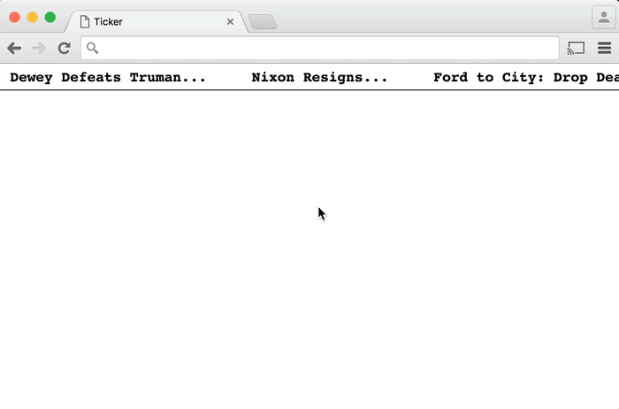

# Project 1 Ticker

## Part 1 Animating Headlines 
When the page loads, the ticker area is empty and headlines start crawling in from the right. The animation continues forever. When a headline moves all the way off the screen it jumps to the end. 

### Part 2 Pause the animation
When a user mouses onto a headline, the animation pauses and the headline turns blue and gain an underline to indicate that it can be clicked. If the user mouses out without clicking, the animation should resume.

**_NOTES_**: 
* Coding technologies: HTML, CSS and Javascript
* Learned how to make use of requestAnimationFrame()/cancelAnimationFrame() method and DOM events. 
