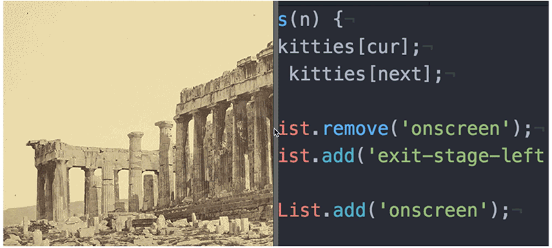

# Project 4 Resizable Panes

Resizable panes are often used to show before and after photos with both images staying the same size as the user drags the bar to reveal more of one photo and less of the other.

After a mousedown event is detected on the bar that sits on top of the images (before mouseup), the bar follows the mouse pointer on the x axis but never move out of the area defined by the left edge and right edge of the images. As the bar moves, the visible portions of the images change correspondingly.

**_NOTES_**: 
* Coding technologies: HTML, CSS, Javascript and Jquery.
