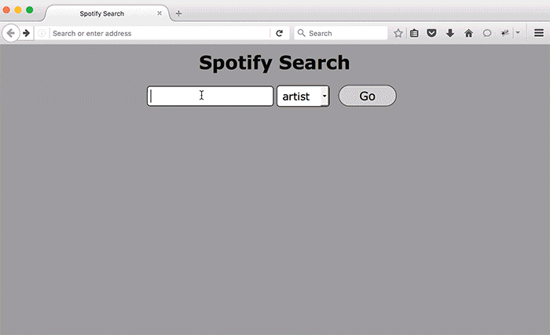

# Project 6 Spotify Search
Spotify used to have a [search API](https://developer.spotify.com/web-api/search-item/) that didn't require authentication and supported CORS. It now requires authentication and pretty much can't be used via ajax directly. 

## Part 1 Text field with two 'artist' and 'album' options
A text field is placed at the top of the page. There are also a 'select' element containing the options "artist" and "album" and a submit button.

## Part 2 Make AJAX request
When the user submits, all the query string parameters are passed to `https://elegant-croissant.glitch.me/spotify`. This url will make a request to the Spotify search API with the specified parameters and send back the exact JSON that Spotify responds with. In order words, this url is used to conduct searches for artists and albums.

## Part 3 Display search results
* The search term in quotes preceded by the string 'Results for ' is displayed before the results.
* For each result, one of the images listed in the payload as well as the artist name or album title is showed. Both items are linked to the url provided in the payload for playing music from that album or artist (if users are not logged in to Spotify they will see a page prompting them to log in).
* The results that do not have any images are handled. 
* If there are no results for a search, a 'no results' message is displayed.

## Part 4 'more' button
By default, the number of results per request is limited to 20. If there are more results, there is a field in the payload that provides an url to get the next batch. The presence of this field decides whether or not to include a "more" link at the bottom of the result list. 

## Part 5 Infinite Scroll
If the string `scroll=infinite` appears in the query string when the page loads, no "More" button should appear. Instead, when users scroll down to the bottom of the listed results, the next page of results is automatically loaded and appended.

**_NOTES_**:
* Coding technologies: HTML, CSS, Javascript, JSON, Jquery and AJAX. 
* For the reasons described in <a href="http://ejohn.org/blog/learning-from-twitter/">this blog post</a>, do not use scroll events.
