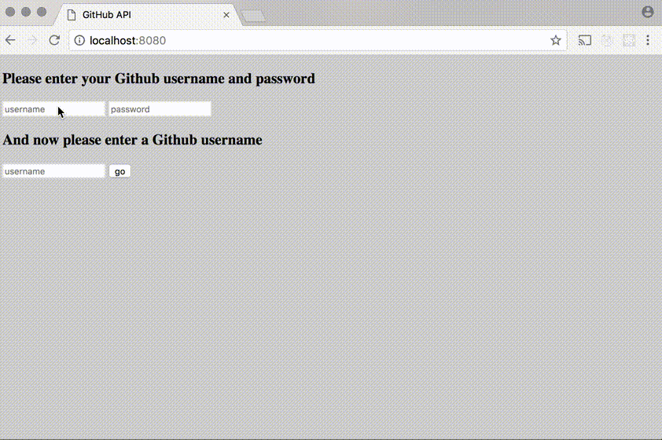

# Project 7 GitHub API
Making use of GitHub API to make a UI that allows users to see a list of public repos belonging to a GitHub user that they specify and to see the last 10 commits made to each.



## Part 1 Build an 'Authorization' header
The GitHub API doesn't require authentication but without a username and password we will run up against rate limits very quickly. For that, users are prompted to insert their username and password. The value of this header should be the string `'Basic `' followed by the username and password joined on `':'` and [base64](https://en.wikipedia.org/wiki/Base64) encoded. The [btoa](https://developer.mozilla.org/en/docs/Web/API/WindowBase64/Base64_encoding_and_decoding) function can be used to base64 encode. For example:

```js
$.ajax({
    url: myGithubApiUrl,
    headers: {
       Authorization: 'Basic ' + btoa(username + ':' + password)
    }
});
```

## Part 2 Display all public repos
<a href="https://developer.github.com/v3/repos/#list-user-repositories">`/users/:username/repos`</a> endpoint is used to get the list of repos. The owner of each repo will be indicated in the response and the owner's profile picture next to each repo name is shown.

## Part 3 Display commits
When users click on a repo, a request to <a href="https://developer.github.com/v3/repos/commits/">`/repos/:owner/:repo/commits`</a> endpoint is made to get a list of commits. Only the last ten commit messages are shown.

**_NOTES_**:
* Coding technologies: HTML, CSS, Javascript, Handlebars, JSON, Jquery and AJAX.
* There should be no ajax request made when the user has only entered her username and password. The only ajax requests to make are the ones to get the repos and the commits. There is no "logging in" to the API. The user's username and password should only be used to construct the `Authorization` header that must be included in all requests to get the repos and commits.
* NEVER PUT GITHUB USER NAME AND PASSWORD INTO the SOURCE CODE!
