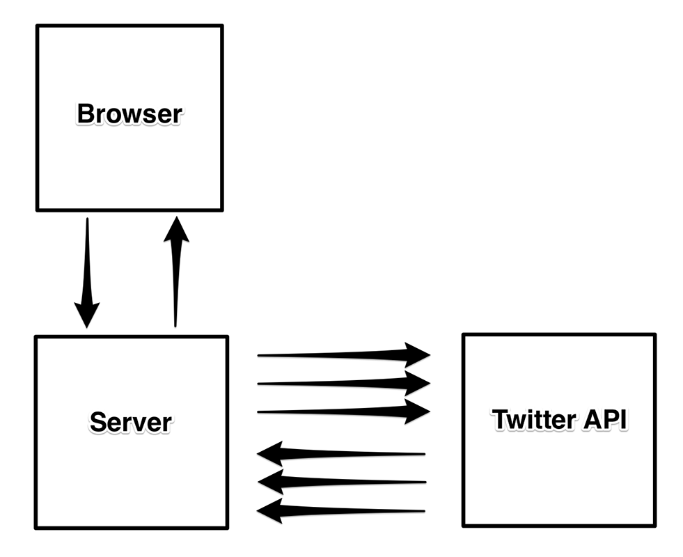

# Project 9 Twitter API
This is a Ticker project displaying the headlines from the Twitter timeline of a news organization, such as <a href="https://twitter.com/theonion">the Onion</a>.

## Part 1 Authentication
The <a href="https://dev.twitter.com/rest/public">Twitter API</a> requires authentication. This means credentials need to be passed with each request. If a request is made via AJAX, the application's credentials would be made available in the browser, which means they would be available to anyone using the site. Unacceptable! Thus all the requests to the Twitter API must be made from the server.

## Part 2 Acquiring 'bearer token'
In order to make requests to get data, a 'bearer token' must be first obtained. It is the bearer token that is used to make subsequent requests. It can be obtained  by following <a href="https://developer.twitter.com/en/docs/basics/authentication/overview/application-only">these instructions</a> step by step (scroll down to the section entitled "Issuing application-only requests").

## Part 3 Making request and get required tweets
The <a href="https://developer.twitter.com/en/docs/tweets/timelines/api-reference/get-statuses-user_timeline">statuses/user_timeline</a> endpoint is used to get tweets. When making the request, two query string parameters are passed. The `screen_name` parameter refers to the user whose tweets are wanted. Additionally, `tweet_mode=extended` is added to the query string to ensure that the full tweet text is obtained, which, as of early 2018, may be up to 280 characters long. The body of the response from this endpoint will be an array of objects representing tweets. The `full_text` property of each object provides the full text of the tweet. The urls contained in the text are listed in the `entities.urls` array.

## Part 4 Display headlines
* In response to AJAX request, only tweets that have just one url that appears at the end of the tweet text are included. The tweets that have no url, have more than one url, or have one url that appears medially are excluded. The text itself will be contained by an `<a>` tag so there is no need to show the url.
* Other urls may still apear in the text. This is because Twitter includes in the tweet text the urls to images and videos that were included in the tweet. Just as the links in a tweet are listed in the tweet's `entities.urls` array, the media urls will be listed in the `entities.media` array. This array is looped through to remove those unwanted media urls from the text.

## Part 5 Server side
In Express app, a static directory is created and Ticker files (see [Project 2](https://github.com/Ee-Chee/SpicedAcademy-Tabasco-Codes-Week1to6/tree/master/Project2-Ticker))are copied into it. A route '/data.json' is made to handle the AJAX request that the client-side Javascript makes. In this route, the retrieval of the token and then the tweets from the Twitter API are initialized. Finally, the tweets are sent back to the client using `res.json`.



**_NOTES_**:
* Coding technologies: HTML, CSS, Javascript, Twitter API, JSON, Jquery, AJAX, Node.js and Express Framework.   
* This project requires a base64-encoded string, and in Node.js, it can be achieved by first converting it to a Buffer (which is a representation of the string's data in binary) and then into a base64 encoded string:

```javascript
Buffer.from("take a deep breath").toString("base64"); // 'dGFrZSBhIGRlZXAgYnJlYXRo'
```
